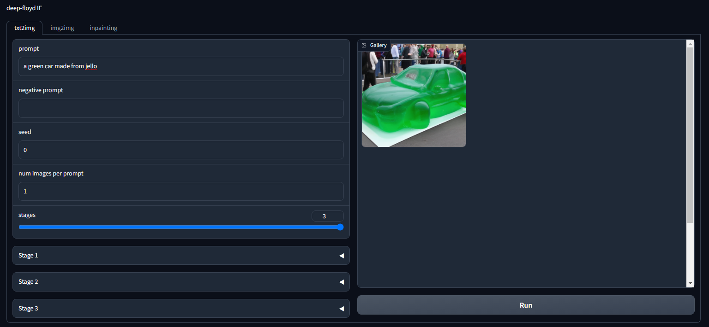

a crude but mostly functional gradio script for deep-floyd IF.
i haven't been able to test everything, as it takes a while to run.
currently supports txt2img, img2img and inpainting.
the following install instructions worked for me:
```
conda create -n deepfloyd python=3.10 -y
conda activate deepfloyd
conda install pip git -y
pip install deepfloyd_if==1.0.1
pip install xformers==0.0.19
pip install git+https://github.com/openai/CLIP.git --no-deps
pip uninstall torch -y
pip install torch torchvision torchaudio --index-url https://download.pytorch.org/whl/cu118
pip install huggingface_hub
pip install --upgrade diffusers accelerate transformers safetensors
pip install gradio
```
